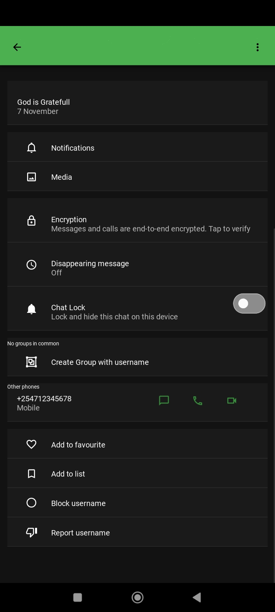
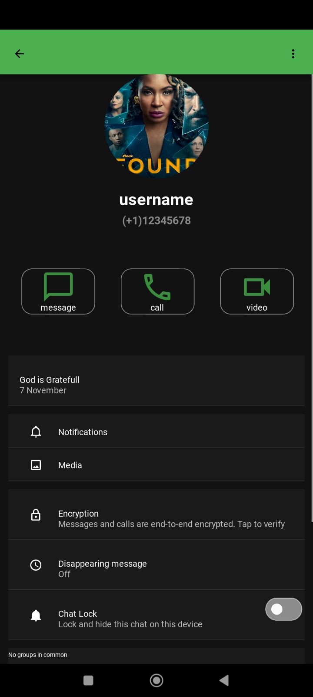

# WhatsAppClone
This project attempts to recreate the userinterface of WhatsApp 
using the kivy and kivymd library
This project is used to show the material design of the kivymd Library
The user interface is recreated according to the current application of the time appearance 

